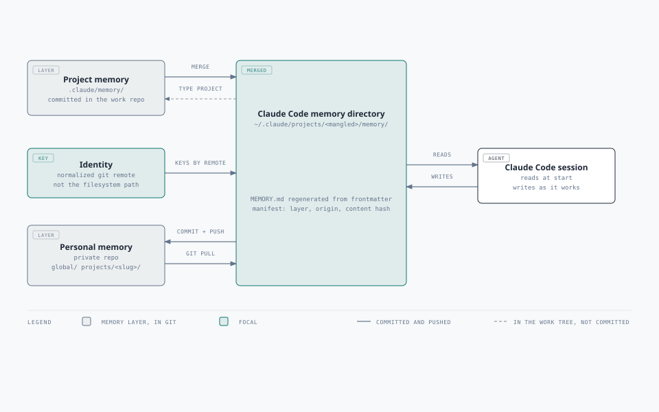

# memory-manager

Cross-machine memory for Claude Code.

## The problem

Claude Code stores per-project memory in `~/.claude/projects/<mangled-absolute-path>/memory/`.
The key is the **absolute filesystem path**, so the same repository cloned to a different
folder — or onto a second machine — resolves to a *different* memory directory. Push the
code, pull it elsewhere, and the memory stays behind.

The mangling is also lossy and case-unstable. On one machine these all collide or split:

```
C:\Users\a\repos\nova_core   ->  C--Users-a-repos-nova-core
C:\Users\a\repos\nova-core   ->  C--Users-a-repos-nova-core   # same directory, different project
c:\Users\a\repos\nova-core   ->  c--Users-a-repos-nova-core   # same project, different directory
```

`memory-manager` keys memory by the **normalized git remote** instead.



## The two layers

| Layer | Holds | Stored in |
|---|---|---|
| **Project** | architecture decisions, conventions, why an option was rejected | `.claude/memory/` committed in the project repo |
| **Personal** | preferences, working-style feedback, cross-project context | a private repo: `global/` and `projects/<slug>/` |

At session start both layers are merged into the directory Claude Code reads, and
`MEMORY.md` is regenerated from each file's frontmatter.

Routing on write is by memory `type`: `project` goes to the project layer,
`user`/`feedback`/`reference` go to the personal layer. An optional `scope: project|personal`
in the frontmatter overrides that default, so a genuinely shared reference can be promoted
with one line while the default stays conservative.

## Status

The cycle is closed: memory comes in at session start and goes back out at session end.

- [x] `identity` — resolve a stable project identity from the git remote
- [x] `init` — pin an identity for a repo with no remote
- [x] `migrate` — adopt memory already living in the path-keyed directories
- [x] `sync` — pull, merge both layers, regenerate the index (the SessionStart hook)
- [x] `status` — show what is waiting to go back to a layer
- [x] `push` — route each change to its layer; commit and push the personal one (the SessionEnd hook)
- [ ] server-backed semantic search over the same files
- [ ] a trimming policy for `MEMORY.md` past ~200 memories

## The cycle

```
SessionStart          during the session            SessionEnd
    sync         Claude writes into the                push
      │          native memory directory                 │
      ▼                     │                            ▼
project layer  ──┐          │          ┌── project layer: written to your
personal layer ──┴─► merged ┴──► diff ─┤   work tree, NOT committed
                    directory           └── personal layer: committed and pushed
```

`push` classifies every change against the manifest the last sync recorded:

| State | Detected by | Where it goes |
|---|---|---|
| added | on disk, not in the manifest | the layer its `type`/`scope` selects |
| updated | content hash differs | back to exactly where it came from |
| removed | in the manifest, gone from disk | deleted from its layer |
| moved | `type` or `scope` now selects the other layer | written to the new layer, deleted from the old |

## Install

**1. The binary.**

```sh
go install github.com/Arlezz/memory-manager/cmd/memory-manager@latest
```

Needs Go 1.23+, and your Go bin directory on `PATH` so the plugin's hook launcher can find the
result. There are no third-party dependencies to fetch.

> **Until the first release is tagged, this is the only install that works.** `npm install -g
> memory-manager-cli` and the `scripts/install.sh` / `pwsh -File scripts/install.ps1` downloads both
> resolve against artifacts that do not exist yet: the npm package is unpublished and there are no
> GitHub releases. Both become available with the first tag; neither needs a Go toolchain.

**2. The plugin**, which wires the hooks:

```
/plugin marketplace add Arlezz/memory-manager
/plugin install memory-manager
```

The plugin declares its own `SessionStart` and `SessionEnd` hooks, so **your `settings.json` is
never touched**. It also adds `/memory-setup`, `/memory-status`, `/memory-sync`, `/memory-push` and
`/memory-migrate`.

If you would rather not use a plugin, the install scripts still merge the two hooks into
`~/.claude/settings.json` directly — they back the file up first, preserve every other setting and
hook, and are idempotent. The plugin is preferred because it avoids editing that file at all.

**3. Point it at your private memory repo, and adopt what you already have:**

```sh
memory-manager config -personal-repo git@github.com:you/claude-memory.git
memory-manager migrate           # review the plan
memory-manager migrate -apply    # adopt what is already on disk
```

An empty repository you just created works: there is no branch to clone yet, and the first run
handles that.

## Documentation

- [docs/how-it-works.md](docs/how-it-works.md) — a walkthrough of what happens on disk, and the
  cases you will actually hit
- [docs/architecture.md](docs/architecture.md) — the design and the reasoning behind each decision
- [docs/security.md](docs/security.md) — threat model, what it protects, and the gaps it knows about

## Design notes

**Identity is the normalized remote, and nothing else.** Scheme, credentials, port, the
`.git` suffix and letter case are all discarded, so the same repo reached over SSH and over
HTTPS lands on one identity. Two checkouts of one repository therefore share memory — backup
folders included. That is deliberate; a checkout that wants its own memory pins it in
`.claude/memory-id`, which also covers repos with no remote and repos moved between orgs.

**Credentials never reach disk.** A remote URL can carry an inline token, and identity slugs
end up in file names, manifests and log lines. Normalization strips credentials before the
value is used anywhere, and `migrate` scans every file for credentials before it will copy it
into a layer that gets committed to a shared repo. A secret that reaches a shared history is
not undone by a revert.

**`MEMORY.md` is generated, never committed.** Everyone who adds a memory touches the index,
so versioning it would guarantee a merge conflict per contributor. Regenerating it from
frontmatter removes the conflict class outright and makes the frontmatter the source of truth.

**Project memory is never committed for you.** It lives inside your work repo, so an automatic
commit would land on whatever branch you are on and leak into your pull request. `push` writes
the files and lists them; you commit them with your code — which also means project memory gets
reviewed the way code does.

**Failures degrade, they never block.** No network, no clone, a dirty personal repo, a corrupt
manifest: each one prints a warning and the session continues on local memory. A hook that
blocks a session is worse than the manual workaround it replaces. Silence is also a failure
mode, so every degradation is reported.

**Local edits are never overwritten.** Claude writes memory straight into the native directory
during a session. `sync` compares each file against the hash the manifest recorded, so an edit
that has not been pushed yet survives the next session start instead of being replaced by the
layer's copy.

**An unavailable layer is not a deletion.** If the personal remote is unreachable, its memories
are kept and still tracked rather than treated as removed upstream — a network blink must not
cost you memory. In the other direction, `push` refuses to propagate a deletion when *every*
tracked file has vanished at once, since that is far more likely to be a wiped directory than a
deliberate purge.

**A conflicting push never leaves a mess.** `push` rebases once and retries. On a real conflict
it aborts the rebase, publishes nothing, and names the file to fix — the clone is never left
mid-operation for a hook nobody is watching.

**`git` is a subprocess, not a library.** It inherits the user's credential helpers, SSH agent
and proxy config. Reimplementing that against a mix of GitHub and self-hosted GitLab would be
the largest source of bugs in the tool.

**Zero third-party dependencies.** The frontmatter parser covers only the subset of YAML the
memory format uses, and reports anything richer instead of guessing.

The reasoning behind each of these is in [docs/architecture.md](docs/architecture.md).

## Compatibility with claude-sync

[claude-sync](https://github.com/tawanorg/claude-sync) solves a neighbouring problem: encrypted
backup of your whole `~/.claude` — transcripts, plans, tasks, history, settings — to object storage.
It diagnoses the same root cause (Claude Code indexes by absolute path) and answers it differently:
it keeps the path as the key and makes the prefix portable with a `${HOME}` token, plus a manual
`path_map` for any other layout difference.

The two are complementary. Use claude-sync for conversation history and this for memory.

**But they overlap on disk, and you have to exclude two paths if you run both.** claude-sync syncs
`~/.claude/projects/` wholesale, and this tool's merged output lives at
`~/.claude/projects/<mangled>/memory/`. Left alone, that means:

- claude-sync would sync the *merged* directory instead of the layers, keyed by path — reintroducing
  the problem this tool exists to fix
- on a simultaneous change it writes the remote version as `<name>.md.conflict.<timestamp>`, which
  this tool's `sync` would then treat as an untracked local memory and list in `MEMORY.md`
- `~/.claude/memory-manager/state/*.json` holds **absolute paths** for the machine that wrote it,
  so syncing manifests between machines makes them wrong

Exclude both in `~/.claude-sync/config.yaml`:

```yaml
exclude:
  - "projects/*/memory/**"
  - "memory-manager/**"
```

## Development

```sh
gofmt -l .          # must print nothing
go vet ./...
go test -race ./...
go build ./cmd/memory-manager
```

Tests run without a network. Most use an isolated `CLAUDE_CONFIG_DIR` plus a `.claude/memory-id`
override so they need neither git nor a remote; the ones that exercise `gitx` and `personal` drive
the real `git` binary against local bare repositories and skip themselves when git is absent.

## Everyday commands

```sh
memory-manager status            # what is waiting to go back to a layer
memory-manager push -dry-run     # classify without writing
memory-manager identity          # which project this directory resolves to
memory-manager sync -dry-run     # what a session start would merge
```
